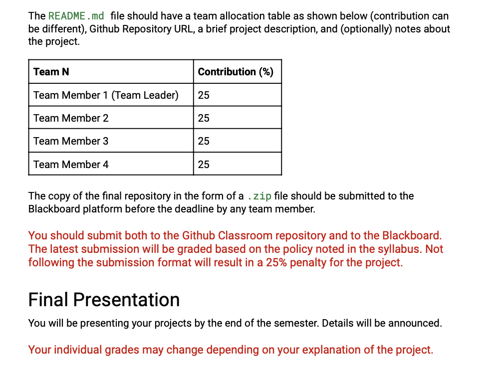

========================================================================================
25%
Kanan Manafov (Team Leader)

- idea and sources
- Web Scraping
- ML
- Proofreading in Web Scraping, Data Cleaning, ML 

========================================================================================
25%
Ibish Aliyev

- idea and sources
- Web Scraping
- Visualization
- Proofreading in Web Scraping, Data Cleaning, ML  

========================================================================================
25%
Ibrahim Asgarov

- idea and sources
- Data Cleaning
- Visualization
- Proofreading in Web Scraping, Data Cleaning, ML 
========================================================================================
25%
Ramil Zeynalov

- idea and sources
- Data Cleaning
- ML
- Proofreading in Web Scraping, Data Cleaning, ML  
========================================================================================
# Github Repository URL: XXXXXXXXXXXXXXXXXXXXXXXXXXXXXXXXXXXXXXXXXXXXXXXXXXXXXXXXXXXXXXX <-----
========================================================================================

Our project is consisting of 4 practical parts, data collection, data cleaning, data visualization and ML Model application.  Our main purpose was demonstrating the knowledge we have got in our Data Information Engineering course from the Instructor Ismayil Shahaliyev. But the aim of the project is simply predicting fee of domestic students by considering some other features. It might be useful predictor for those want to open a new university, and do not know how to set the fee for domestic students at the beggining because the model is able to predict appropriate fees for all courses in our dataset. By considering this project as a template, we can improve this idea and dataset to serve those are planning to open a new govermental or private university.  
========================================================================================

